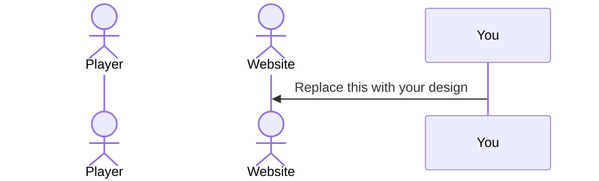

# InkSpace

[My Notes](notes.md)

Handwriting Speed Competition Game with global leaderboards.

> [!NOTE]
> This is a template for your startup application. You must modify this `README.md` file for each phase of your development. You only need to fill in the section for each deliverable when that deliverable is submitted in Canvas. Without completing the section for a deliverable, the TA will not know what to look for when grading your submission. Feel free to add additional information to each deliverable description, but make sure you at least have the list of rubric items and a description of what you did for each item.

> [!NOTE]
> If you are not familiar with Markdown then you should review the [documentation](https://docs.github.com/en/get-started/writing-on-github/getting-started-with-writing-and-formatting-on-github/basic-writing-and-formatting-syntax) before continuing.

## 🚀 Specification Deliverable

> [!NOTE]
> Fill in this sections as the submission artifact for this deliverable. You can refer to this [example](https://github.com/webprogramming260/startup-example/blob/main/README.md) for inspiration.

For this deliverable I did the following. I checked the box `[x]` and added a description for things I completed.

- [x] Proper use of Markdown
- [x] A concise and compelling elevator pitch
- [x] Description of key features
- [x] Description of how you will use each technology
- [x] One or more rough sketches of your application. Images must be embedded in this file using Markdown image references.

### Elevator pitch

I built a machine learning model that can read what people physically write. Ink is a game that puts you against your friends in handwriting. The model checks for accuracy, and words written the fastest are put on a global leaderboard. Monitization is done by different skins, backgrounds, helpers, pets, and sponsorships. There are also educational applications that provide areas of future expansion. 

### Design

The idea is to have the focus completely on the writing, with other pages for leaderboards, navigation, etc. 

### Key features

- Timed Rounds
- Scoring
- Leaderboards
- Practice mode to choose which words you want
- See other players attempts and scores real time

### Technologies

I am going to use the required technologies in the following ways.

- **HTML** - use (header/main) semantics, a canvas for drawing, and forms for login and register
- **CSS** - Responsive layout, clean ui (heavily focused on game page). Small animations like a countdown or feedback
- **React** - Single page app with routes. Comps like drawing pad, timer, results, etc.
- **Service** - Backend for: register page, getting the next word, submitting an attempt and getting a score, getting leaderboard, gotta get the ML prediction. Third party api for getting random words or showing definitions of chosen words or something.
- **DB/Login** - Store Users, hashed passwords, session tokens, attempts, leaderboard stuff. Must be authenticated to submit.
- **WebSocket** - Broadcast when people finish attempts or there is a new record for a word.

## 🚀 AWS deliverable

For this deliverable I did the following. I checked the box `[x]` and added a description for things I completed.

- [x] **Server deployed and accessible with custom domain name** - [My server link](https://inkspace.click).

## 🚀 HTML deliverable

For this deliverable I did the following. I checked the box `[x]` and added a description for things I completed.

- [x] **HTML pages** - Created `index.html`, `login.html`, `game.html`, `practice.html`, `leaderboards.html`, and `about.html` with consistent semantic structure.
- [x] **Proper HTML element usage** - Added `<header>`, `<nav>`, `<main>`, `<footer>`, sections, lists, forms, tables, and canvas placeholders.
- [x] **Links** - Wired nav links across all pages plus “Back to Home” links on content pages.
- [x] **Text** - Added homepage description, features list, and “How it works” steps.
- [x] **3rd party API placeholder** - Added dictionary/random word placeholder with 3rd-party services section and flow description.
- [x] **Images** - Added local SVGs and placed images on home and practice pages with alt text.
- [x] **Login placeholder** - Added login/register form placeholders and “Logged in as: Guest” display.
- [x] **DB data placeholder** - Added leaderboard tables and a JSON `<pre>` block showing DB-stored records.
- [x] **WebSocket placeholder** - Added a live feed panel with WebSocket event notes.

### HTML Notes

- Pages created: `index.html`, `login.html`, `game.html`, `practice.html`, `leaderboards.html`, `about.html`
- Navigation: shared nav links to Home, Game, Practice, Leaderboards, Login, About; “Back to Home” links on content pages
- Login placeholder: email/password login form, register form, and “Logged in as: Guest”
- Canvas drawing area: on `game.html` and `practice.html`
- DB placeholder: leaderboard tables + JSON block on `leaderboards.html`
- WebSocket placeholder: live feed panel on `game.html`
- 3rd-party placeholder: dictionary/random word services + flow on `practice.html`
- Images: local SVG assets in `images/` and embedded on `index.html` and `practice.html`

## 🚀 CSS deliverable

For this deliverable I did the following. I checked the box `[x]` and added a description for things I completed.

- [x] **Visually appealing colors and layout. No overflowing elements.** - I did not complete this part of the deliverable.
- [x] **Use of a CSS framework** - Added Tailwind via `@import 'tailwindcss';` in `src/index.css`.
- [x] **All visual elements styled using CSS** - Added simple styles for tables, `pre`, and `canvas`, plus consistent section/form/link styling.
- [x] **Responsive to window resizing using flexbox and/or grid display** - Made the `nav` a flex container with wrapping.
- [x] **Use of a imported font** - Imported Google Font `Roboto` and set it on `body`.
- [x] **Use of different types of selectors including element, class, ID, and pseudo selectors** - Used element selectors (e.g., `nav`, `section`), class selector (`.nav-link`), ID selector (`#main-nav`), and pseudo selectors (`:hover`, `:focus`, `:active`).

### CSS Notes (summary)

- Base reset, typography, and responsive images/forms for consistent defaults.
- Full-width layout with simple spacing and light borders on header/nav/footer.
- Minimal styles for sections, lists, forms, buttons, tables, `pre`, and canvas.
- Navigation uses flex-wrap and includes the GitHub repo link.
- Tailwind imported and Google Font (Roboto)

## 🚀 React part 1: Routing deliverable

For this deliverable I did the following. I checked the box `[x]` and added a description for things I completed.

- [x] **Bundled using Vite** - Added Vite scripts and built the app with `npm run build`.
- [x] **Components** - Split the app into React view components (`home`, `play`, `practice`, `scores`, `leaderboards`, `about`, `login`).
- [x] **Router** - Added `react-router-dom` routes and `NavLink` navigation for SPA routing.

## 🚀 React part 2: Reactivity deliverable

For this deliverable I did the following. I checked the box `[x]` and added a description for things I completed.

- [x] **All functionality implemented or mocked out** - Completed interactive React flows for `Play`, `Practice`, `Login`, and `Scores` using mock/local data sources. `Play` and `Practice` both run full round loops with start/submit/result states, timer logic, correctness checks, and live UI updates.
- [x] **Hooks** - Implemented `useState` and `useEffect` across major components for round lifecycle, timer intervals with cleanup, auth state/loading from `localStorage`, word/definition loading, leaderboard loading, and live-feed subscription/unsubscription.

### react part 2 Notes

- `Play` is now a loop with phases (`idle`, `countdown`, `active`, `submitted`, `result`), timer cleanup, typing submission, correctness check, and rolling live feed updates.
- `Practice` is now an alternate loop with word set selection, custom word parsing, definition lookup mock, timer-driven rounds, submit handling, and next-word cycling.
- `DrawingPad` is reusable and integrated into both `Play` and `Practice`, including clear/reset behavior tied to component state.
- `Login` uses controlled forms, validation, error/success states, and `localStorage` session persistence (`currentUser`, `authToken`).
- `Scores` loads leaderboard views from a mock data layer and supports loading/error/empty states.
- Mock real-time events are generated with `setInterval` and cleaned up on unmount via `useEffect` cleanup.

## 🚀 Service deliverable

For this deliverable I did the following. I checked the box `[x]` and added a description for things I completed.

- [ ] **Node.js/Express HTTP service** - I did not complete this part of the deliverable.
- [ ] **Static middleware for frontend** - I did not complete this part of the deliverable.
- [ ] **Calls to third party endpoints** - I did not complete this part of the deliverable.
- [ ] **Backend service endpoints** - I did not complete this part of the deliverable.
- [ ] **Frontend calls service endpoints** - I did not complete this part of the deliverable.
- [ ] **Supports registration, login, logout, and restricted endpoint** - I did not complete this part of the deliverable.

## 🚀 DB deliverable

For this deliverable I did the following. I checked the box `[x]` and added a description for things I completed.

- [ ] **Stores data in MongoDB** - I did not complete this part of the deliverable.
- [ ] **Stores credentials in MongoDB** - I did not complete this part of the deliverable.

## 🚀 WebSocket deliverable

For this deliverable I did the following. I checked the box `[x]` and added a description for things I completed.

- [ ] **Backend listens for WebSocket connection** - I did not complete this part of the deliverable.
- [ ] **Frontend makes WebSocket connection** - I did not complete this part of the deliverable.
- [ ] **Data sent over WebSocket connection** - I did not complete this part of the deliverable.
- [ ] **WebSocket data displayed** - I did not complete this part of the deliverable.
- [ ] **Application is fully functional** - I did not complete this part of the deliverable.
