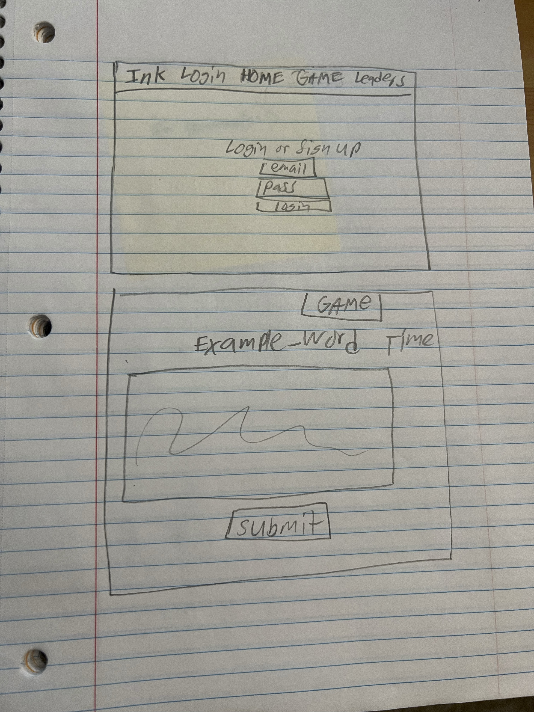
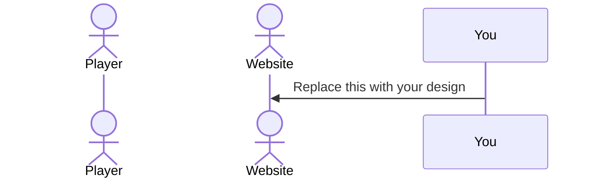

# InkSpace

[My Notes](notes.md)

Handwriting Speed Competition Game with global leaderboards.

> [!NOTE]
> This is a template for your startup application. You must modify this `README.md` file for each phase of your development. You only need to fill in the section for each deliverable when that deliverable is submitted in Canvas. Without completing the section for a deliverable, the TA will not know what to look for when grading your submission. Feel free to add additional information to each deliverable description, but make sure you at least have the list of rubric items and a description of what you did for each item.

> [!NOTE]
> If you are not familiar with Markdown then you should review the [documentation](https://docs.github.com/en/get-started/writing-on-github/getting-started-with-writing-and-formatting-on-github/basic-writing-and-formatting-syntax) before continuing.

## 🚀 Specification Deliverable

> [!NOTE]
> Fill in this sections as the submission artifact for this deliverable. You can refer to this [example](https://github.com/webprogramming260/startup-example/blob/main/README.md) for inspiration.

For this deliverable I did the following. I checked the box `[x]` and added a description for things I completed.

- [x] Proper use of Markdown
- [x] A concise and compelling elevator pitch
- [x] Description of key features
- [x] Description of how you will use each technology
- [x] One or more rough sketches of your application. Images must be embedded in this file using Markdown image references.

### Elevator pitch

I built a machine learning model that can read what people physically write. Ink is a game that puts you against your friends in handwriting. The model checks for accuracy, and words written the fastest are put on a global leaderboard. Monitization is done by different skins, backgrounds, helpers, pets, and sponsorships. There are also educational applications that provide areas of future expansion. 

### Design

The idea is to have the focus completely on the writing, with other pages for leaderboards, navigation, etc. 

```mermaid
sequenceDiagram
    actor Player
    actor Website
    You->>Website: Replace this with your design
```

### Key features

- Timed Rounds
- Scoring
- Leaderboards
- Practice mode to choose which words you want
- See other players attempts and scores real time

### Technologies

I used the required technologies in the following ways.

- **HTML** - Semantic page structure, login/register forms, tables for scores, and a canvas-based drawing area.
- **CSS** - Responsive layout, game-focused UI styling, and small timer/result animations.
- **React** - Vite-based SPA with routes for play, practice, scores, leaderboards, about, and login.
- **Service** - Express backend in `service/` for auth, words, attempts, leaderboards, and the handwriting prediction endpoint.
- **DB/Login** - In-memory users, sessions, and attempts for this phase. Passwords are hashed with `bcryptjs`, sessions use cookie-based auth, and restricted endpoints require login.
- **WebSocket** - Real backend WebSocket support is still planned for the later deliverable. The current live feed remains mock client-side data.

## 🚀 AWS deliverable

For this deliverable I did the following. I checked the box `[x]` and added a description for things I completed.

- [x] **Server deployed and accessible with custom domain name** - [My server link](https://inkspace.click).

## 🚀 HTML deliverable

For this deliverable I did the following. I checked the box `[x]` and added a description for things I completed.

- [x] **HTML pages** - Created `index.html`, `login.html`, `game.html`, `practice.html`, `leaderboards.html`, and `about.html` with consistent semantic structure.
- [x] **Proper HTML element usage** - Added `<header>`, `<nav>`, `<main>`, `<footer>`, sections, lists, forms, tables, and canvas placeholders.
- [x] **Links** - Wired nav links across all pages plus “Back to Home” links on content pages.
- [x] **Text** - Added homepage description, features list, and “How it works” steps.
- [x] **3rd party API placeholder** - Added dictionary/random word placeholder with 3rd-party services section and flow description.
- [x] **Images** - Added local SVGs and placed images on home and practice pages with alt text.
- [x] **Login placeholder** - Added login/register form placeholders and “Logged in as: Guest” display.
- [x] **DB data placeholder** - Added leaderboard tables and a JSON `<pre>` block showing DB-stored records.
- [x] **WebSocket placeholder** - Added a live feed panel with WebSocket event notes.

### HTML Notes

- Pages created: `index.html`, `login.html`, `game.html`, `practice.html`, `leaderboards.html`, `about.html`
- Navigation: shared nav links to Home, Game, Practice, Leaderboards, Login, About; “Back to Home” links on content pages
- Login placeholder: email/password login form, register form, and “Logged in as: Guest”
- Canvas drawing area: on `game.html` and `practice.html`
- DB placeholder: leaderboard tables + JSON block on `leaderboards.html`
- WebSocket placeholder: live feed panel on `game.html`
- 3rd-party placeholder: dictionary/random word services + flow on `practice.html`
- Images: local SVG assets in `images/` and embedded on `index.html` and `practice.html`

## 🚀 CSS deliverable

For this deliverable I did the following. I checked the box `[x]` and added a description for things I completed.

- [x] **Visually appealing colors and layout. No overflowing elements.** - I did not complete this part of the deliverable.
- [x] **Use of a CSS framework** - Added Tailwind via `@import 'tailwindcss';` in `src/index.css`.
- [x] **All visual elements styled using CSS** - Added simple styles for tables, `pre`, and `canvas`, plus consistent section/form/link styling.
- [x] **Responsive to window resizing using flexbox and/or grid display** - Made the `nav` a flex container with wrapping.
- [x] **Use of a imported font** - Imported Google Font `Roboto` and set it on `body`.
- [x] **Use of different types of selectors including element, class, ID, and pseudo selectors** - Used element selectors (e.g., `nav`, `section`), class selector (`.nav-link`), ID selector (`#main-nav`), and pseudo selectors (`:hover`, `:focus`, `:active`).

### CSS Notes (summary)

- Base reset, typography, and responsive images/forms for consistent defaults.
- Full-width layout with simple spacing and light borders on header/nav/footer.
- Minimal styles for sections, lists, forms, buttons, tables, `pre`, and canvas.
- Navigation uses flex-wrap and includes the GitHub repo link.
- Tailwind imported and Google Font (Roboto)

## 🚀 React part 1: Routing deliverable

For this deliverable I did the following. I checked the box `[x]` and added a description for things I completed.

- [x] **Bundled using Vite** - Added Vite scripts and built the app with `npm run build`.
- [x] **Components** - Split the app into React view components (`home`, `play`, `practice`, `scores`, `leaderboards`, `about`, `login`).
- [x] **Router** - Added `react-router-dom` routes and `NavLink` navigation for SPA routing.

## 🚀 React part 2: Reactivity deliverable

For this deliverable I did the following. I checked the box `[x]` and added a description for things I completed.

- [x] **All functionality implemented or mocked out** - Completed interactive React flows for `Play`, `Practice`, `Login`, and `Scores` using mock/local data sources. `Play` and `Practice` both run full round loops with start/submit/result states, timer logic, correctness checks, and live UI updates.
- [x] **Hooks** - Implemented `useState` and `useEffect` across major components for round lifecycle, timer intervals with cleanup, auth state/loading from `localStorage`, word/definition loading, leaderboard loading, and live-feed subscription/unsubscription.

### react part 2 Notes

- `Play` is now a loop with phases (`idle`, `countdown`, `active`, `submitted`, `result`), timer cleanup, typing submission, correctness check, and rolling live feed updates.
- `Practice` is now an alternate loop with word set selection, custom word parsing, definition lookup mock, timer-driven rounds, submit handling, and next-word cycling.
- `DrawingPad` is reusable and integrated into both `Play` and `Practice`, including clear/reset behavior tied to component state.
- `Login` uses controlled forms, validation, error/success states, and `localStorage` session persistence (`currentUser`, `authToken`).
- `Scores` loads leaderboard views from a mock data layer and supports loading/error/empty states.
- Mock real-time events are generated with `setInterval` and cleaned up on unmount via `useEffect` cleanup.

## 🚀 Service deliverable

For this deliverable I did the following. I checked the box `[x]` and added a description for things I completed.

- [x] **Node.js/Express HTTP service** - Built an Express backend in `service/index.js` running separately from the Vite frontend on port `4000`.
- [x] **Static middleware for frontend** - Added `app.use(express.static('public'))` to the Express service for deployed static serving.
- [x] **Calls to third party endpoints** - Practice mode fetches definitions directly from Merriam-Webster in the browser using `VITE_MERRIAM_WEBSTER_KEY` and displays the first `shortdef` entry.
- [x] **Backend service endpoints** - Added endpoints for auth, word selection, prediction, attempt submission, personal attempts, and leaderboards.
- [x] **Frontend calls service endpoints** - Replaced mock/localStorage service modules with fetch-based API clients that call relative `/api/...` routes through the Vite proxy.
- [x] **Supports registration, login, logout, and restricted endpoint** - Added backend register/login/logout/session routes, hashed passwords with `bcryptjs`, cookie auth, and restricted endpoints like `POST /api/attempts` and `GET /api/attempts/me`.

### Service Notes

- Backend app: `service/index.js`
- Frontend dev server: `npm run dev`
- Backend dev server: `npm run service`
- Frontend dev proxy: `vite.config.js` proxies `/api` to `http://127.0.0.1:4000`
- Auth endpoints: `POST /api/auth/register`, `POST /api/auth/login`, `POST /api/auth/logout`, `GET /api/auth/me`
- Word endpoints: `GET /api/words/next`, `GET /api/words/practice?level=easy|medium|hard`
- Prediction endpoint: `POST /api/predict`
- Attempt/leaderboard endpoints: `POST /api/attempts`, `GET /api/attempts/me`, `GET /api/leaderboards/global`, `GET /api/leaderboards/friends`, `GET /api/leaderboards/words`
- Restricted endpoints: `POST /api/attempts` and `GET /api/attempts/me` require a valid auth cookie
- Current storage mode: MongoDB for users, sessions, and attempts
- Third-party definition fetch: Merriam-Webster key stored in `.env.local` as `VITE_MERRIAM_WEBSTER_KEY`

### Local Run

1. Install frontend dependencies with `npm install`
2. Install backend dependencies with `cd service && npm install`
3. Start the backend with `npm run service`
4. Start the frontend with `npm run dev`
5. Restart the Vite dev server if `.env.local` changes

### Validation Notes

- Verified the frontend still builds successfully with `npm run build`
- Verified the service file parses successfully with `node --check service/index.js`
- Confirmed the frontend now loads sessions from `GET /api/auth/me` instead of localStorage
- Confirmed gameplay/practice now use backend word and prediction endpoints plus backend attempt submission
- Confirmed practice definitions now come from Merriam-Webster in the browser
- Backend data now persists in MongoDB across service restarts

## 🚀 DB deliverable

For this deliverable I did the following. I checked the box `[x]` and added a description for things I completed.

- [x] **Stores data in MongoDB** - Moved gameplay attempts and leaderboard-backed data into MongoDB collections and updated the service endpoints to read/write persisted data instead of in-memory arrays.
- [x] **Stores credentials in MongoDB** - Moved registered users and login sessions into MongoDB, kept password hashing with `bcryptjs`, and made cookie-based auth resolve against stored session/user records.

### DB Notes

- Mongo setup lives in `service/database.js`
- Collections: `users`, `sessions`, `attempts`
- Startup now pings MongoDB, creates indexes, and seeds the starter leaderboard attempts only if the attempts collection is empty

## 🚀 WebSocket deliverable

For this deliverable I did the following. I checked the box `[x]` and added a description for things I completed.

- [x] **Backend listens for WebSocket connection** - Added a `WebSocketServer` to the existing Express backend in `service/index.js`, serving the `/ws` path on the same backend port and keeping connections alive with a ping/pong heartbeat.
- [x] **Frontend makes WebSocket connection** - Replaced the mock live events service with a real browser WebSocket client in `src/services/liveEventsService.js` and created one shared client at the app level in `src/app.jsx`.
- [x] **Data sent over WebSocket connection** - After a successful `POST /api/attempts`, the backend now broadcasts an `attempt/saved` event using one JSON envelope with `type` and `payload`.
- [x] **WebSocket data displayed** - The `Play` page live feed now subscribes to real socket events and shows connection status plus saved attempt messages from other clients.
- [x] **Application is fully functional** - Play and Practice both save real attempts over HTTP, those saved attempts are pushed over WebSocket, and the Leaderboards page refreshes when live attempt events arrive.

### WebSocket Notes

- Home page prerequisite: `src/home/home.jsx` now shows my name and a direct GitHub repo link on the home page.
- Backend socket path: `/ws`
- Backend socket code: `service/index.js`
- Frontend socket client: `src/services/liveEventsService.js`
- Live feed UI: `src/play/play.jsx`
- Leaderboard live refresh: `src/leaderboards/leaderboards.jsx`
- Dev proxy: `vite.config.js` proxies both `/api` and `/ws` to `http://127.0.0.1:4000`
